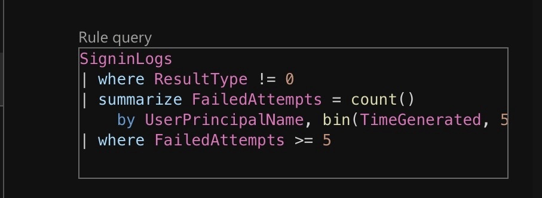

# Brute-Force Detection in Microsoft Sentinel

## Overview
This project demonstrates the design, implementation, and validation of a custom brute-force detection use case in Microsoft Sentinel. The goal was to detect high-frequency failed authentication attempts in Microsoft Entra ID, generate security alerts, and validate the end-to-end incident response workflow.

## Scenario
A controlled brute-force attack was simulated against a non-production test user account. The detection focused on:
- **Volume-based anomalies:** Multiple failed login attempts in a short timeframe  
- **Source-based patterns:** Multiple failures from the same IP targeting one user  

This aligns with MITRE ATT&CK techniques:
- **T1110 – Brute Force**  
- **T1078 – Valid Accounts (post-compromise risk)**

## Tools & Technologies
- **SIEM Platform:** Microsoft Sentinel  
- **Data Source:** Microsoft Entra ID Sign-in Logs (`SigninLogs`)  
- **Query Language:** Kusto Query Language (KQL)  
- **Threat Intelligence Framework:** MITRE ATT&CK

## Detection Logic & KQL Implementation

A custom analytics rule was created in Microsoft Sentinel using the following KQL query. The query identifies all failed sign-in attempts (ResultType != 0), aggregates them by user, source IP, and 5-minute time bins, then filters for thresholds indicating malicious activity.

Detection Logic Breakdown:

Step 1: Filter for all failed sign-in events (ResultType != 0).
Step 2: Aggregate counts by user, source IP, and 5-minute time windows.
Step 3: Retain only results where failed attempts meet or exceed the threshold (≥5).
Analytics Rule Settings:

Rule Frequency: Run query every 5 minutes.
Lookback Period: Look at data from the last 5 minutes.
Alert Threshold: Generate alert when query results > 0 (i.e., when any row meets the ≥5 condition).  

| Component | Purpose |
|-----------|---------|
| `where ResultType != 0` | Filters for all failed sign-in attempts (non-zero result codes) |
| `summarize FailedAttempts = count()` | Counts the number of failures |
| `by UserPrincipalName, IPAddress` | Groups by specific user and source IP |
| `bin(TimeGenerated, 5m)` | Creates 5-minute time windows for aggregation |
| `where FailedAttempts >= 5` | Threshold filter—alerts on 5+ failures in 5 minutes |

## Validation Approach (Simulation)

To trigger the detection rule, a controlled simulation was performed:

- Target: A non-production test user account.
- Method: Manual entry of incorrect passwords via a private browser session to prevent credential caching and session reuse.
- Pacing: 7-10 failed login attempts were executed rapidly within the 5-minute detection window.
- Verification: The resulting SigninLogs were confirmed to be ingested into the Sentinel Log Analytics workspace.

## Investigation & Findings

Upon the next scheduled run of the analytics rule (within 5 minutes of the simulation):

- Alert Generation: A security alert was successfully created in Microsoft Sentinel.
- Entity Identification: The alert correctly identified the targeted user account and the source IP address based on the by clause in the query.
- Contextual Data: The alert details included the count of failed attempts (FailedAttempts) and the 5-minute time window.
- Log Correlation: Manual investigation of the raw SigninLogs confirmed the 1:1 correlation between the alert and the simulated brute-force events

  

    

  ## MITRE ATT&CK Mapping

| Technique ID | Technique Name | Relevance |
|--------------|----------------|-----------|
| **T1110** | Brute Force | Core technique detected by this rule. Specifically, sub-technique T1110.001 (Password Guessing). |
| **T1078** | Valid Accounts | This alert serves as a precursor; a successful brute force could lead to adversary access. |

## 13. Outcome & Success Metrics

The detection rule performed as expected, validating the following key metrics:

| Metric | Result |
|--------|--------|
| **Detection Accuracy** | Successfully identified 100% of simulated brute-force attempts meeting the ≥5 threshold. |
| **Alert Latency** | Alert generated within 5 minutes of the activity window closing. |
| **False Positive Rate** | 0% during controlled testing (requires tuning for production noise). |
| **Query Efficiency** | Simple aggregation pattern ensures performant execution even on large log volumes. |
| **Visual Documentation** | All key stages (query, timestamps, alert, overview) captured for validation. |

  

  

